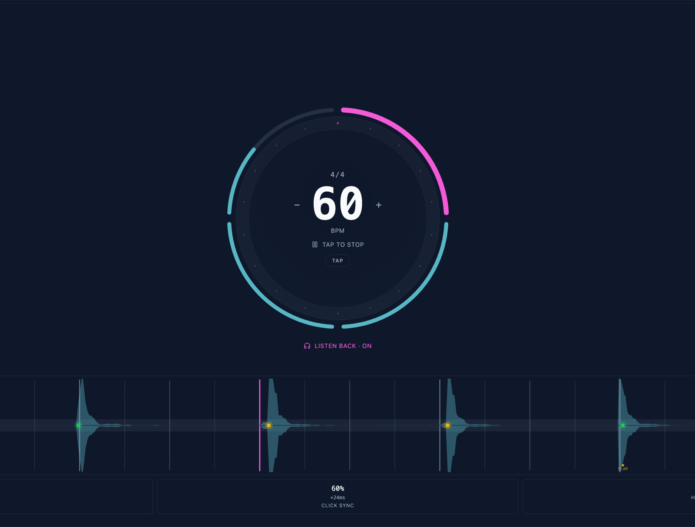
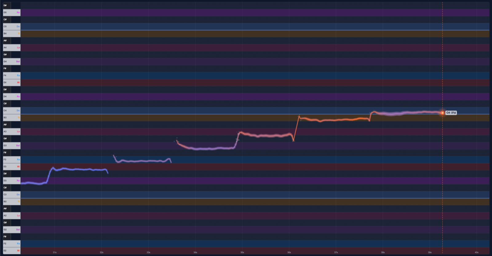

# Musical Playground

Free in-browser music practice tools — a real-time **Vocal Monitor** with pitch trace and exercises, and a **Metronome** with mic listen-back, latency calibration, and timed practice sessions.

**Live at: [flappynote.com](https://flappynote.com)**






---

## Tools

### 🎙 Vocal Monitor

Real-time pitch visualization on a piano roll.

- **Continuous pitch trace** — your voice as a line scrolling over time, scale-degree-aware highlighting, solfège labels.
- **Vocal exercises** — ladders, tonic-return patterns, triads, sevenths, and intervals (semitone through fifth, up and down). Targets render ahead of the playhead; hits color-fade on contact.
- **Rolling key** — automatically advances the root through a configurable range (semitone / whole-tone / scale-degree steps; ascending or descending) as exercises complete.
- **Reference drone** — sustained root tone or full triad. Built-in cancellation keeps the drone out of the pitch detector.
- **Interactive piano keyboard** — click + drag the keys to play reference tones with portamento.

### ⏱ Metronome

A clean rotary metronome with deep practice features.

- **Big rotary BPM dial** — drag to set tempo, click the number to type one in directly. Works on touch with optional vibration haptics.
- **Time signatures** 2/4 through 12/8, with **subdivisions** (eighths / triplets / sixteenths / sextuplets).
- **Per-beat accent pattern** — tap a beat to cycle regular → accent → silent. Accents render in a distinct color; silent beats appear dashed.
- **Tap tempo** — taps anywhere in the dial center; BPM updates from rolling-window median.
- **Skip pattern** — play *N* bars then mute for *M* bars. Practice keeping the beat without the click.
- **Practice sessions** — set session length and interval length (e.g. 10 min × 1 min). 5-second countdown, distinct two-tone chime at every interval transition, smooth progress bar through each interval.
- **Mic listen-back** — listens for percussion (drum pad, claps, taps), plots each detected hit against the beat grid.
  - Color-coded by which subdivision you snapped to (kelly green for quarters, lime for eighths, teal for sixteenths, emerald for triplets), yellow for "close", red for "off".
  - Separate **on grid** and **click sync** stats — accuracy when keeping time without the click vs only with the audible clicks.
  - **Flam detection** — close-pair hits where sticks aren't synchronized get a "FLAM" marker.
  - **Latency calibration** — 5-second auto-routine that listens to the metronome's own clicks and computes roundtrip latency. Manual override available.

---

## Features that span both tools

- **Dark + light mode** — follows system preference automatically. Theming via shadcn-style CSS HSL tokens; swapping a palette is one block in `src/index.css`.
- **Bookmarkable URLs** — `/vocal-monitor`, `/metronome`. Add any tool to your iPhone home screen and it opens fullscreen.
- **Progressive Web App** — installable, offline-capable manifest, theme-color aware mobile chrome.
- **No signup, no install, no upload** — all audio processing happens locally in your browser.

---

## Getting started

### Requirements

- Modern browser (Chrome, Safari, Firefox, Edge — recent)
- Microphone access
- Headphones strongly recommended (keeps the drone and metronome click out of the mic input)

### Run locally

```bash
# Install dependencies
npm install

# Dev server (http://localhost:3000)
npm run dev

# Run the test suite
npm test

# Production build
npm run build
npm run preview
```

---

## Tech stack

- **React 19** + **React Router 7**
- **Vite 7** + **@vitejs/plugin-react**
- **Tailwind CSS 3** + **shadcn/ui** (Radix primitives) + **lucide-react**
- **Web Audio API** — mic capture, lookahead scheduler, oscillator-synthesized clicks, drone and tone generation
- **TensorFlow.js** + custom CREPE-style model for high-accuracy pitch detection
- **pitchy** (MPM) as a pitch-detection fallback
- **Vitest** for unit tests

---

## Project structure

```
src/
├── app/                       # React app shell
│   ├── App.jsx                  - BrowserRouter + routes + page-view tracking
│   ├── AppShell.jsx             - Top bar with brand + active-tool icon + back link
│   ├── AppFooter.jsx            - Help / GitHub / Fullscreen toggle
│   ├── ToolIndex.jsx            - "/" — tool catalog cards
│   ├── ToolFallback.jsx
│   ├── NotFound.jsx
│   ├── useColorScheme.js        - Mirrors prefers-color-scheme onto <html>
│   └── icons/GithubIcon.jsx
│
├── components/ui/             # shadcn/ui primitives
├── lib/
│   ├── utils.js                 - cn() class-merge helper
│   └── analytics.js             - Tiny gtag wrapper (page views + tool events)
│
├── tools/
│   ├── registry.js              - Tool catalog (icon, path, lazy Component)
│   │
│   ├── vocal-monitor/
│   │   ├── VocalMonitorPage.jsx        - Page composition (services + layout)
│   │   ├── VocalMonitorController.js   - DOM-agnostic canvas controller
│   │   ├── VocalMonitorRenderer.js     - Canvas drawing
│   │   ├── VocalMonitorState.js        - Pitch history + viewport
│   │   ├── PianoRoll.js                - Piano keyboard + scale highlights
│   │   ├── PitchCanvas.jsx             - <canvas> + controller lifecycle
│   │   ├── Sidebar.jsx, Toolbar.jsx
│   │   ├── ExerciseEngine.js, ExerciseRenderer.js
│   │   ├── ScaleTimeline.js, RollingKeyManager.js
│   │   ├── canvasTheme.js              - Reads CSS HSL vars per frame
│   │   ├── useSharedSettings.js
│   │   ├── rollingKeyOptions.js
│   │   └── exercises/                  - 20+ exercise definitions
│   │
│   └── metronome/
│       ├── MetronomePage.jsx           - Page composition
│       ├── MetronomeEngine.js          - Web Audio lookahead scheduler
│       ├── MetronomeDial.jsx           - Rotary BPM dial + visual beat ring
│       ├── PracticeTracker.jsx         - Session state machine + countdown
│       ├── ListenBackPanel.jsx         - Unified canvas: waveform / grid / hits
│       ├── MicListener.js              - Mic stream + AnalyserNode → detector
│       ├── OnsetDetector.js            - Peak-based percussion onset detection
│       ├── HitTracker.js               - Beat matching + flam detection + stats
│       ├── clickSamples.js             - Synthesized click bank (woodblock, click, beep, cowbell)
│       ├── sensitivity.js              - Slider ↔ detector threshold mapping
│       ├── Sidebar.jsx
│       └── Toolbar.jsx
│
├── core/                      # Shared, non-React systems
│   ├── PitchContext.js, ScaleManager.js, DroneManager.js
│   └── SharedSettings.js        - localStorage-backed observable settings
│
├── pitch-engine/              # Pitch detection (CREPE / MPM+YIN)
├── audio/TonePlayer.js
├── config/scales.js
├── index.css                  # Tailwind base + shadcn HSL theme tokens
└── main.jsx                   # ReactDOM.createRoot mount
```

---

## License

MIT — feel free to fork, learn from, or build on this.

## Credits

Built with AI assistance (Claude by Anthropic).

---

- **Site:** [flappynote.com](https://flappynote.com)
- **Vocal Monitor:** [flappynote.com/vocal-monitor](https://flappynote.com/vocal-monitor)
- **Metronome:** [flappynote.com/metronome](https://flappynote.com/metronome)
- **GitHub:** [github.com/bsod90/flappynote](https://github.com/bsod90/flappynote)
